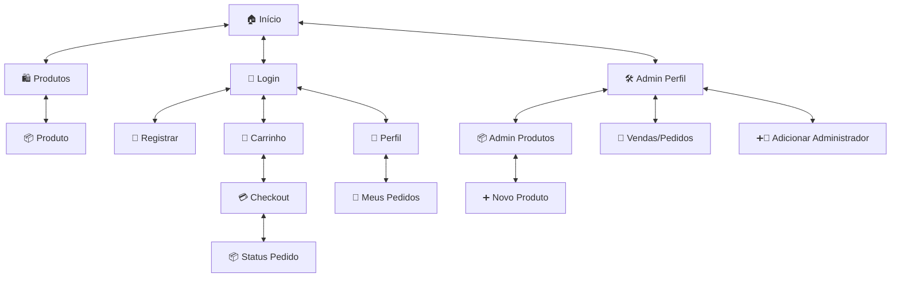

# 🐾 Projeto: ADIMAX PET SHOP

## 👥 Grupo
- André Marcelino Watanabe — NUSP: 14558311
- Renato Spessotto — NUSP: 14605824

---

## 📌 1. Requisitos e Visão Geral

O **ADIMAX PET SHOP** é uma aplicação web de e-commerce voltada para um pet shop fictício. Desenvolvida com **React (Vite)** no frontend e **Node.js + Express + MongoDB** no backend, a plataforma permite uma experiência de compra completa para o cliente e oferece ferramentas administrativas de gerenciamento.

### Usuários:
- **Clientes:** navegam, compram, acompanham pedidos e editam perfil.
- **Administradores:** gerenciam produtos, pedidos e outros administradores.

### Funcionalidades principais:
- Catálogo com filtros por tipo, faixa etária e marca.
- Carrinho persistente por usuário logado.
- Finalização de pedidos com validação de estoque.
- Cadastro/login com controle de sessão.
- Perfil com histórico de compras.
- Área administrativa com gestão de produtos/pedidos.
- Barra de busca inteligente no topo.

---

## 📝 2. Funcionalidades Implementadas

### 🔐 Autenticação
- Registro e login de usuários e administradores.
- Context API com persistência no localStorage.
- Middleware protegendo rotas privadas (admin e user).

### 🛒 Compras e Catálogo
- Lista de produtos com filtros dinâmicos.
- Carrinho interativo com validação de estoque.
- Página de produto com detalhes e imagens.
- Finalização de compra com escolha de método de pagamento.

### 👤 Perfil e Histórico
- Página de perfil com dados do usuário.
- Histórico de pedidos anteriores.
- Edição de informações pessoais.

### 🛠️ Área Administrativa
- Adição, edição e exclusão de produtos.
- Gerenciamento de pedidos realizados.
- Cadastro de novos administradores.
- Upload real de imagem com `multer`.

### 🔎 Busca Inteligente
- Barra de busca com sugestões em tempo real.
- Navegação rápida para produtos filtrados.

---

## 🗺️ 3. Diagrama de Navegação



---

## ⚙️ 4. Tecnologias Utilizadas

### Frontend
- React + Vite
- React Router
- Context API
- CSS Modules
- Fetch API

### Backend
- Node.js
- Express
- MongoDB com Mongoose
- Multer (upload de imagens)
- Dotenv
- Nodemon

---

## 🏗️ 5. Estrutura do Projeto

```
Projeto-Desenvolvimento-Web/
├── adimax/                  # Frontend (React)
│   ├── src/
│   │   ├── componentes/     # Componentes visuais
│   │   ├── context/         # AuthContext
│   │   └── App.jsx          # Estrutura principal
├── backend/                 # Backend (Node.js + Express)
│   ├── src/
│   │   ├── routes/          # Rotas da API
│   │   └── server.js        # Servidor principal
│   ├── uploads/             # Imagens dos produtos
│   └── banco_json/          # Backup local (opcional)
└── README.md
```

---

## 🚀 6. Como Executar o Projeto

### Pré-requisitos
- Node.js instalado
- MongoDB local ativo
- MongoDB Compass (opcional para visualizar dados)

### Backend:

```bash
cd backend
npm install
npm install dotenv
npm install multer -> se necesário
```


### Frontend:

```bash
cd adimax
npm install
npm run dev
```

 **Acesse a aplicação em:**
```
http://localhost:3000
```

### Visualizando no MongoDB Compass
- Abra o Compass
- Conecte com a string:
```
mongodb://localhost:27017
```
- Escolha o banco `adimax-petshop` e visualize as coleções como `produtos`, `usuarios`, `pedidos` e `carrinho`.


---

## 🧪 7. Testes Realizados

Os testes foram conduzidos manualmente no ambiente local, com foco nas principais funcionalidades da aplicação. Foram utilizados diferentes tipos de usuários (cliente e administrador), explorando os fluxos possíveis e também ações inesperadas para garantir a robustez da aplicação. Abaixo, os cenários testados:

---

### 🔐 Autenticação e Registro

- ✅ **Cadastro de usuário (cliente e admin)**:
  - Testado com dados válidos (nome, email com formato válido, senha com mais de 6 caracteres).
  - Testado com dados inválidos (email sem `@`, senhas com menos de 6 caracteres).
  - Validação de exibição de mensagens de erro.
  - Verificação do redirecionamento automático após cadastro bem-sucedido.
- ✅ **Login**:
  - Login realizado com credenciais válidas e persistência de sessão via `localStorage`.
  - Teste de login com email inexistente e senha incorreta: sistema exibe mensagem de erro clara e não realiza login.
  - Sessão mantida após atualização da página e logout funcional.

---

### 🛍️ Catálogo e Busca

- ✅ **Listagem de produtos**:
  - Exibição completa de todos os produtos cadastrados no banco de dados.
  - Testes com e sem filtros aplicados (tipo, marca, faixa etária).
  - Combinação de múltiplos filtros testada (ex: “cachorro” + “Brinquedos” + “a partir de 3 anos”).
- ✅ **Busca inteligente no header**:
  - Sugestões dinâmicas exibidas conforme o usuário digita.
  - Testado com busca parcial (ex: “raspad…” encontra “Raspadinha de carne”).
  - Testado com termos inexistentes (ex: “xyz”) — retorno correto de "nenhum item encontrado".

---

### 🛒 Carrinho de Compras

- ✅ **Adição ao carrinho**:
  - Produtos adicionados com quantidade padrão .
  - Vários produtos diferentes e múltiplas quantidades testados.
  - Se a compra exceder a quantidade do estoque no banco de dados é exibida uma mensagem de erro.
- ✅ **Remoção e atualização**:
  - Produtos removidos individualmente.
  - Quantidade ajustada corretamente, respeitando limites de estoque.
  - Quantidade zerada remove o produto automaticamente do carrinho.
- ✅ **Persistência**:
  - Produtos no Carrinho são mantidos ao atualizar a página e ao alternar entre login/logout.

---

### 💳 Finalização de Pedido (Checkout)

- ✅ **Fluxo de checkout**:
  - Pagamento simulado com métodos PIX e Cartão.
  - Geração de pedido com ID único e salvamento no banco (JSON/localStorage).
  - Checkout só pode prosseguir se todos os campos obrigatórios forem preenchidos e se um método de pagamento for escolhido e preenchido corretamente.
- ✅ **Validação de estoque**:
  - Sistema impede compra se quantidade desejada for maior que o estoque.
  - Mensagem clara ao tentar comprar produto esgotado.

---

### 🧑‍💼 Painel Administrativo

- ✅ **Gestão de produtos**:
  - Cadastro de novo produto testado com preenchimento completo e incompleto (validações exibem mensagens).
  - Edição reflete corretamente na tela de listagem e no JSON.
  - Exclusão implementada como soft delete (produto marcado como inativo, sem exclusão do arquivo no banco de dados MongoDB).
- ✅ **Gestão de pedidos**:
  - Todos os pedidos aparecem com ID, produtos, total, e dados do comprador.
  - Verificado: atualização automática no mongoDb da listagem após finalização de pedidos.

---

### 👤 Perfil do Usuário

- ✅ **Edição de dados pessoais**:
  - Alteração de nome, email e senha reflete corretamente na próxima sessão.
  - Senha antiga continua inválida após atualização.
- ✅ **Histórico de pedidos**:
  - Lista em ordem cronológica (mais recente no topo).
  - Cada pedido inclui: data, produtos comprados, total e status.

---

### 🧪 Considerações Finais

- Todos os testes foram realizados manualmente em navegadores:
  - **Google Chrome (v124)** e **Mozilla Firefox (v125)**.
- Testes em diferentes resoluções (1920x1080 e 1366x768) confirmaram responsividade básica.
- Foram testadas ações inesperadas (ex: recarregar carrinho com produto removido do sistema, editar usuário sem estar logado).
- Nenhuma falha crítica ou comportamento inesperado foi detectado durante os testes.
---


### 🍃 Integração com MongoDB (Teste Local com MongoDB Compass)

- ✅ **Conexão com banco MongoDB local**:
  - O backend foi configurado para se conectar a um banco de dados MongoDB local utilizando a biblioteca `mongoose`.
  - A string de conexão foi definida via variável de ambiente no arquivo `.env`, no formato:
    ```env
    MONGO_URL=mongodb://localhost:27017/adimax-petshop
    ```

- ✅ **Criação e persistência de dados**:
  - Ao cadastrar um novo produto via rota POST (`/produtos`), os dados foram inseridos corretamente na coleção `produtos` do banco.
  - A verificação foi feita diretamente no **MongoDB Compass**, observando a criação automática da base de dados e das coleções.

- ✅ **Leitura dos dados**:
  - Ao acessar a rota GET (`/produtos`), todos os documentos armazenados no MongoDB foram retornados e exibidos no frontend corretamente.

- ✅ **Atualização de documentos**:
  - Utilizando a rota PUT (`/produtos/:id`), foi possível atualizar campos como nome, descrição, preço e estoque de um produto.
  - A alteração foi confirmada tanto no frontend quanto visualmente no MongoDB Compass.

- ✅ **Remoção (soft delete)**:
  - Ao excluir um produto via rota DELETE (`/produtos/:id`), ele não foi removido fisicamente do banco, mas sim marcado como "inativo" (dependendo da lógica de negócio).
  - Isso permite manter o histórico no banco e evitar inconsistências.

- ✅ **Teste com dados reais**:
  - Foram cadastrados produtos com dados reais, e confirmada a consistência da estrutura:
    ```json
    {
      "nome": "Ração Premium Cães Adultos",
      "marca": "Adimax",
      "preco": 129.99,
      "estoque": 20,
      "faixaEtaria": "Adulto",
      "tipo": "Ração",
      "descricao": "Ração completa para cães adultos de médio porte.",
      "imagem": "link-da-imagem"
    }
    ```

- ✅ **Ambiente visual para validação**:
  - Todo o conteúdo do banco foi visualizado em tempo real através do **MongoDB Compass**, permitindo validação rápida de inserções, alterações e exclusões.

---

### ✅ Considerações sobre o MongoDB

- A utilização do MongoDB possibilitou simular um banco de dados real, com persistência completa dos dados criados no frontend.
- A separação por coleções (`produtos`, `usuarios`, `pedidos`, `carrinho`) foi essencial para organização e testes isolados.
- Em uma futura versão, a hospedagem no MongoDB Atlas permitirá testes e uso remoto, sem necessidade de instalação local.


---

## 📈 8. Funcionalidade Especial

A barra de **busca inteligente no header** permite que o usuário visualize sugestões de produtos em tempo real, conforme digita o nome. É sensível a maiúsculas/minúsculas e filtra automaticamente por nome parcial. Também, os filtros presentes na página principal de produtos que permitem buscar determinados produtos de acordo com sua classificação.

---

## 📊 9. Melhorias Futuras

- Integração com banco remoto (ex: MongoDB Atlas)

---


## 🧠 10. Comentários Sobre o Código

- Estrutura modular e bem separada (componentes, contexto, rotas)
- Comentários explicativos nas rotas e componentes críticos
- Uso de Context API e hooks do React
- Middleware de autenticação reutilizável

---

## 🔬 11. Plano de Testes

- 🧪 Testar login/cadastro com dados válidos e inválidos
- 🛒 Testar fluxo de compra completo
- 📥 Testar upload de imagem real
- 🔍 Validar busca por nome parcial
- 🧰 Visualizar persistência via MongoDB Compass
- 🧼 Testar responsividade em dispositivos móveis

---

## 🔢 12. Resultados dos Testes

| Área               | Teste Realizado                                     | Resultado |
|--------------------|-----------------------------------------------------|-----------|
| **Autenticação**   | Cadastro, login e persistência de sessão            | ✅ Sucesso |
| **Catálogo**       | Filtros, busca por nome, visualização de produto    | ✅ Sucesso |
| **Carrinho**       | Adição, remoção, atualização de quantidade          | ✅ Sucesso |
| **Checkout**       | Simulação de pagamento, validação de estoque        | ✅ Sucesso |
| **Perfil do Usuário** | Edição de dados, exibição de pedidos anteriores | ✅ Sucesso |
| **Painel Admin**   | Cadastro, edição e exclusão de produtos/pedidos     | ✅ Sucesso |
| **MongoDB**        | Inserção, leitura, atualização e soft delete        | ✅ Sucesso |

---

## ⚠️ 13. Problemas Encontrados

- Erros de formatação no `.json` durante testes iniciais
- Integração do formulário com upload de imagem exigiu ajustes de rota e `multer`
- Confusões no controle de permissões (resolvidas com middleware)

---
## 📄 14. Comentários Finais do Projeto

O projeto **ADIMAX PET SHOP** entrega uma experiência completa de e-commerce, com autenticação, gerenciamento de produtos, carrinho e painel administrativo. O uso de arquivos JSON facilita a prototipação e testes, e a arquitetura modular permite fácil evolução para banco de dados real e novas features.

---


💖 **ADIMAX PET SHOP — Cuidando do seu pet como família!**


