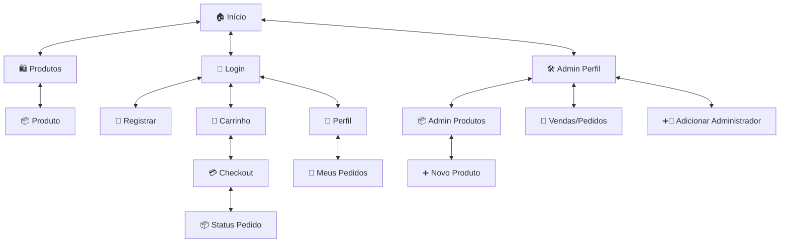

# 🐾 Projeto: ADIMAX PET SHOP

## 👥 Grupo
- André Marcelino Watanabe — NUSP: 14558311
- Renato Spessotto — NUSP: 14605824

---

## 📌 1. Requisitos e Visão Geral

O **ADIMAX PET SHOP** é uma aplicação web completa de e-commerce para pet shop, desenvolvida com **React (Vite)** no frontend e **Node.js + Express** no backend, utilizando arquivos JSON como banco de dados simulado. O sistema oferece funcionalidades reais de loja virtual, incluindo catálogo de produtos, carrinho, autenticação, painel administrativo e histórico de pedidos.

### Usuários:
- **Clientes:** podem navegar, comprar, visualizar histórico e editar perfil.
- **Administradores:** gerenciam produtos, pedidos e usuários.

### Funcionalidades Principais:
- Catálogo de produtos com filtros e busca.
- Carrinho de compras persistente por usuário.
- Finalização de pedidos com validação de estoque.
- Autenticação (login/registro) para clientes e admins.
- Perfil do usuário com histórico de compras.
- Painel administrativo para gestão de produtos e pedidos.
- Busca rápida de produtos no header.

---

## 📝 2. Funcionalidades Implementadas

### 🔐 Autenticação e Permissões
- Login e registro de usuários e administradores.
- Controle de sessão via Context API e localStorage.
- Rotas protegidas para admins e usuários.

### 🛍️ Catálogo de Produtos
- Listagem de produtos com filtros por marca, tipo e faixa etária.
- Busca por nome de produto (header e página de produtos).
- Visualização de detalhes do produto.

### 🛒 Carrinho de Compras
- Adição, remoção e atualização de quantidade de produtos.
- Validação de estoque em tempo real.
- Carrinho persistente por usuário autenticado.

### 💳 Checkout e Pedidos
- Finalização de compra com simulação de métodos de pagamento (PIX e cartão).
- Geração de pedido e atualização automática do estoque.
- Página de status do pedido com detalhes.

### 👤 Perfil do Usuário
- Visualização e edição de dados pessoais.
- Histórico de pedidos realizados.

### 🛠️ Painel Administrativo
- Cadastro, edição e exclusão (soft delete) de produtos.
- Visualização e gerenciamento de todos os pedidos.
- Registro de novos administradores.

### 🔎 Busca Inteligente
- Barra de busca global no header com sugestões instantâneas.

---

## 🗺️ 3. Diagrama de Navegação

```mermaid
graph TD
  Home[🏠 Início]
  Produtos[🛍 Produtos]
  Produto[📦 Produto]
  Login[🔐 Login]
  Register[📝 Registrar]
  Carrinho[🛒 Carrinho]
  Checkout[💳 Checkout]
  Status[📦 Status Pedido]
  Perfil[👤 Perfil]
  Pedidos[📄 Meus Pedidos]

  Admin[🛠 Admin Perfil]
  AdminProdutos[📦 Admin Produtos]
  AdminPedidos[📄 Vendas/Pedidos]
  AdminNovo[➕ Novo Produto]
  AdminRegistro[➕📝 Adicionar Administrador]

  %% Fluxo principal do usuário
  Home <--> Produtos <--> Produto 
  Home <--> Login <--> Register
  Login <--> Perfil <--> Pedidos

  %% Admin
  Home <--> Admin <--> AdminProdutos <--> AdminNovo
  Admin <--> AdminPedidos
  Admin <--> AdminRegistro
  Login<--> Carrinho <--> Checkout <--> Status

```
---

## ⚙️ 4. Tecnologias e Arquitetura

### Frontend
- **React + Vite**: SPA rápida e moderna.
- **Context API**: Gerenciamento global de autenticação.
- **CSS Modules**: Estilização modular e responsiva.
- **React Router**: Navegação entre páginas.
- **Fetch API**: Comunicação com backend.

### Backend
- **Node.js + Express**: API RESTful.
- **Arquivos JSON**: Simulação de banco de dados (`produtos.json`, `usuarios.json`, `pedidos.json`, `carrinho.json`).
- **Rotas protegidas**: Middleware para autenticação/admin.

---

## 🏗️ 5. Estrutura do Projeto

```
Projeto-Desenvolvimento-Web/
├── adimax/                # Frontend React (Vite)
│   ├── src/
│   │   ├── componentes/   # Componentes React (Produtos, Carrinho, Perfil, Admin, etc.)
│   │   ├── context/       # Context API (AuthContext)
│   │   ├── assets/        # Imagens e logos
│   │   └── App.css        # Estilos globais
│   └── index.html
├── backend/               # Backend Node.js + Express
│   ├── src/
│   │   ├── routes/        # Rotas (produtos, usuarios, pedidos, carrinho)
│   │   └── server.js      # Inicialização do servidor
│   └── banco_json/        # "Banco de dados" em arquivos JSON
│       ├── produtos.json
│       ├── usuarios.json 
│       ├── pedidos.json
│       └── carrinho.json
└── README.md              # Este arquivo
```

---

## 🚀 6. Como Executar o Projeto

### Pré-requisitos
- Node.js (v16+)
- npm (ou yarn)

### Passos

1. **Clone o repositório:**
   ```bash
   git clone https://github.com/andremw7/Projeto-Desenvolvimento-Web
   ```

2. **Instale as dependências do frontend:**
   ```bash
   cd Projeto-Desenvolvimento-Web/adimax
   npm install
   ```

3. **Inicie o frontend:**
   ```bash
   npm run dev
   ```

4. **Instale as dependências do backend:**
   ```bash
   cd ../backend
   npm install
   ```

5. **Inicie o backend:**
   ```bash
   npm run dev
   ```

6. **Acesse a aplicação:**
   ```
   http://localhost:3000
   ```

---

## 🧪 7. Testes Realizados

- **Cadastro e login**: Testes com usuários comuns e admins, validação de senha e email.
- **Carrinho**: Adição, remoção, atualização de quantidade, validação de estoque.
- **Checkout**: Simulação de pagamento, geração de pedido, atualização de estoque.
- **Admin**: Cadastro, edição e exclusão de produtos, visualização de todos os pedidos.
- **Perfil**: Visualização e edição de dados, histórico de compras.
- **Busca**: Teste da barra de busca global e filtros de produtos.

---

## 💡 8. Funcionalidade Específica

- **Barra de Pesquisa no Header:** A funcionalidade específica do grupo é a barra de pesquisa inteligente localizada no Header da aplicação. Ela permite ao usuário buscar produtos por nome de forma instantânea, exibindo sugestões dinâmicas enquanto digita. O componente está implementado em `Header.jsx` e realiza a busca em tempo real no catálogo, facilitando a navegação e melhorando a experiência do usuário.

---

## 📈 9. Melhorias Futuras

- Integração com banco de dados real (PostgreSQL/MongoDB).
- Upload real de imagens de produtos.
- Dashboard administrativo com gráficos e analytics.
- Testes automatizados (Jest, Postman).
- Recuperação de senha e autenticação JWT.
- Checkout com integração de pagamento real.

---

## 💬 10. Comentários Finais

O projeto **ADIMAX PET SHOP** entrega uma experiência completa de e-commerce, com autenticação, gerenciamento de produtos, carrinho e painel administrativo. O uso de arquivos JSON facilita a prototipação e testes, e a arquitetura modular permite fácil evolução para banco de dados real e novas features.

---

🧡 **ADIMAX PET SHOP — Cuidando do seu pet como família!**


