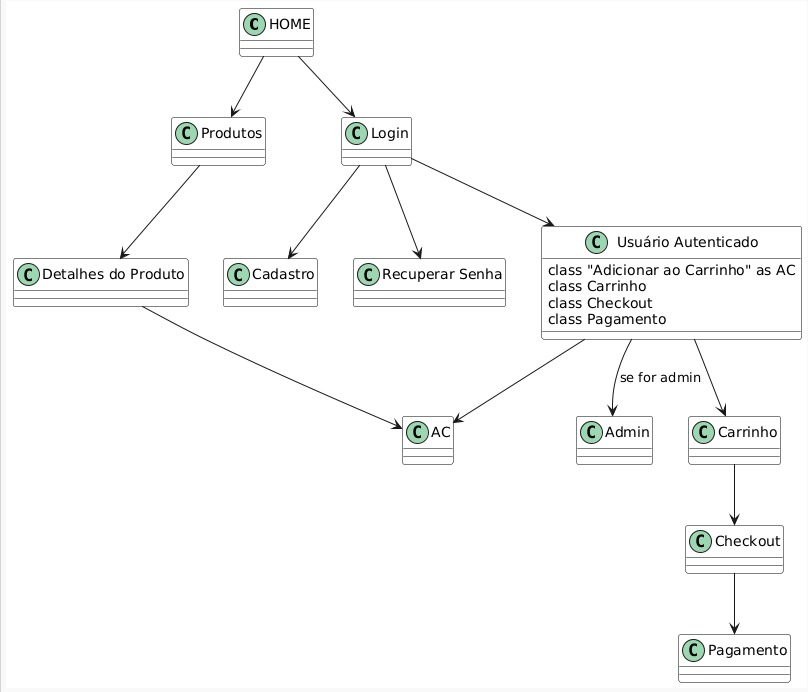

==============================
Project Report — ADIMAX PET SHOP 🐾
==============================

## Group Identification:
- André Marcelino Watanabe — USP Number: 14558311
- Renato Spessotto — USP Number: 14605824

---

## Project Overview:

The ADIMAX PET SHOP project is a fully functional online store system developed using React, Vite, Node.js, and Express. It provides real-world features such as product browsing, cart management, user authentication, and an admin panel for product and order management.

---

## Functionalities Implemented:

### General Features:
- **Product Catalog:** Browse products with filters for brand, type, and age group.
- **Shopping Cart:** Add, update, and remove products.
- **Checkout:** Finalize purchases with stock validation.
- **Authentication:** Login and registration for users and administrators.
- **User Profile:** View personal data and purchase history.
- **Admin Panel:** Manage products and orders.
- **Product Search:** Search for products by name directly in the header dropdown.

### Admin Features:
- **Add Products:** Add new products to the catalog.
- **Edit Products:** Update product details.
- **Delete Products:** Mark products as excluded.
- **Order Management:** View and manage customer orders.

---

## Technologies Used:

### Frontend:
- **React + Vite:** Fast and efficient development framework.
- **Context API:** Global state management for authentication and permissions.
- **CSS Modules:** Modular and reusable styling.

### Backend:
- **Node.js + Express:** API for handling product, user, and order data.
- **JSON Files:** Simulated database for storing products, users, and orders.

---

## Navigation Diagram 🧭

The diagram below illustrates the navigation flow of the application, including login, permissions, cart access, admin panel, and checkout:



---

## How to Run the Project:

### Prerequisites:
- Node.js installed.
- Package manager (npm or yarn).

### Steps:
1. Clone the repository:
   ```bash
   git clone https://github.com/andremw7/Projeto-Desenvolvimento-Web
   ```
2. Navigate to the project folder:
   ```bash
   cd Projeto-Desenvolvimento-Web/adimax
   ```
3. Install dependencies:
   ```bash
   npm install
   ```
4. Start the development server for the frontend:
   ```bash
   npm run dev
   ```
5. Navigate to the backend folder:
   ```bash
   cd ../backend
   ```
6. Start the API server:
   ```bash
   npm run dev
   ```
7. Access the project in your browser:
   ```
   http://localhost:3000
   ```

---

## Planned Features:

- **Database Integration:** Replace JSON files with a real database.
- **Admin Panel Enhancements:** Add advanced analytics and user management.
- **Automated Testing:** Implement Selenium and Postman for testing.

---

## Comments:

The ADIMAX PET SHOP project has successfully evolved into a functional system with authentication, product management, and cart features. Future improvements will focus on database integration, enhanced admin functionalities, and automated testing.

🧡 **ADIMAX PET SHOP — Taking care of your pet like family!**
